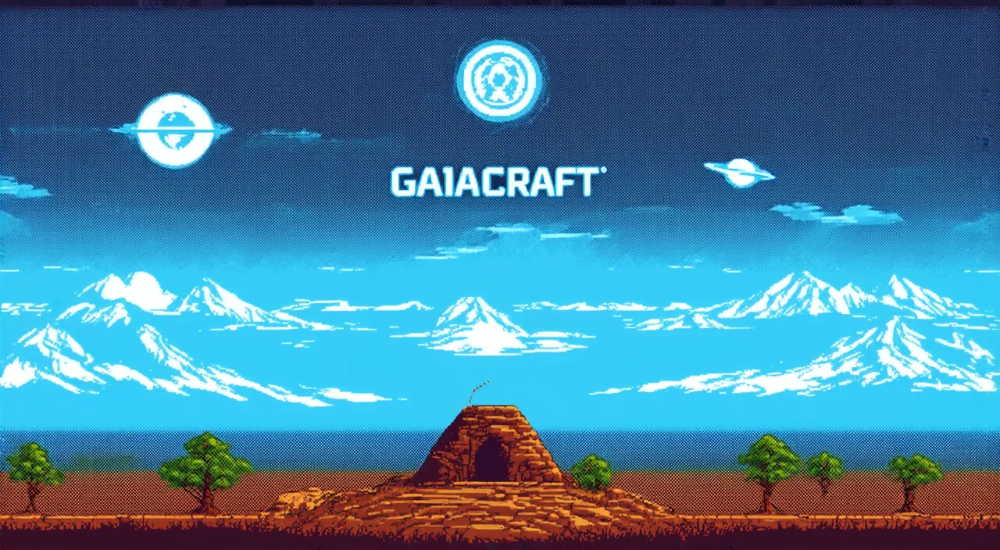
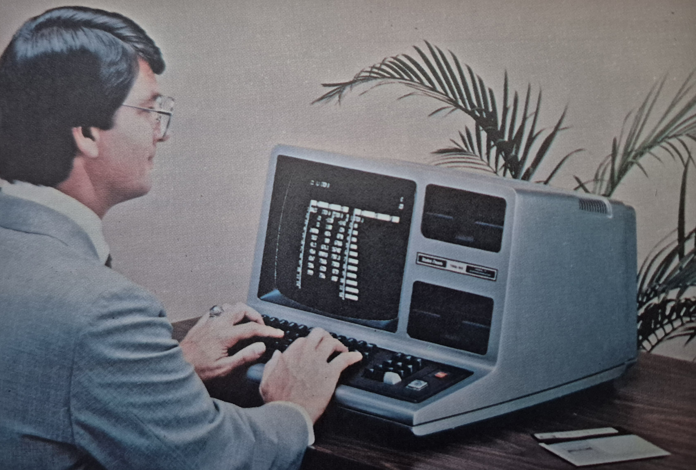
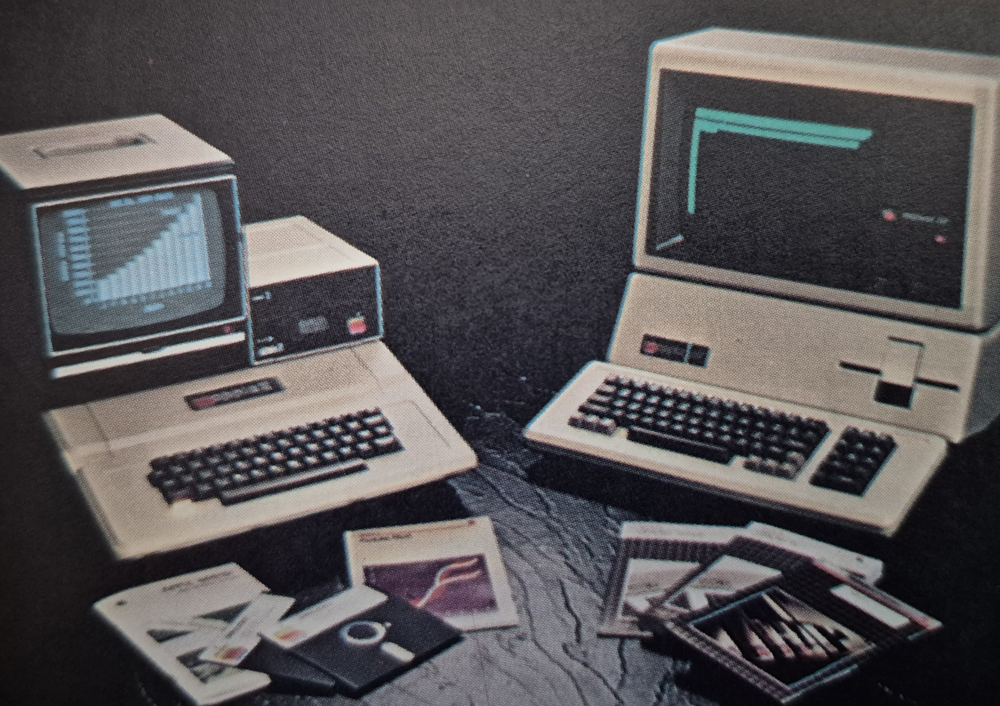
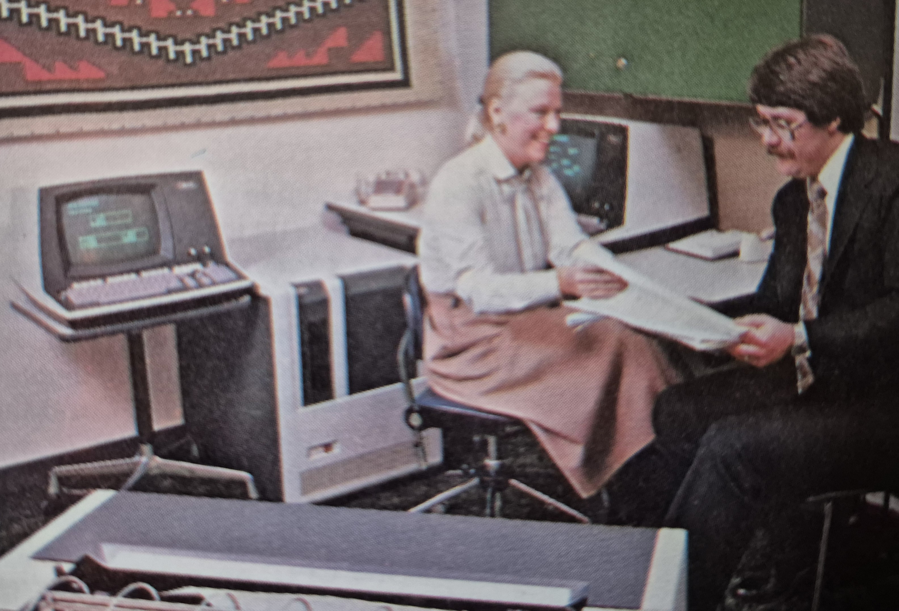
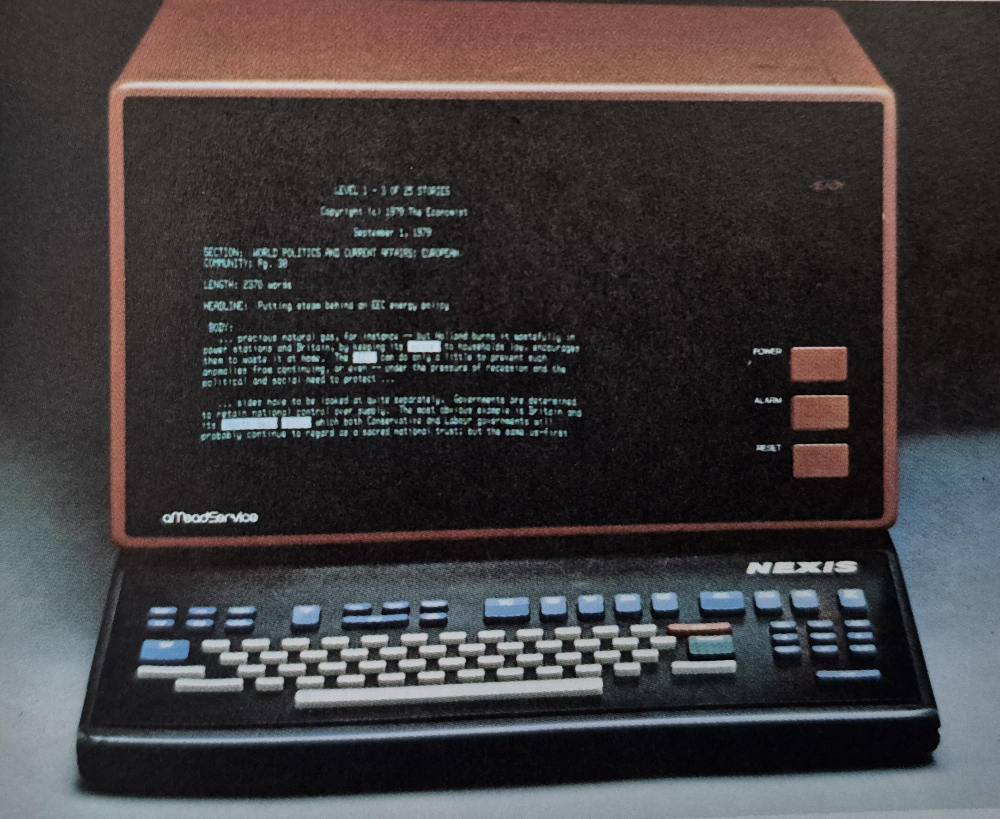
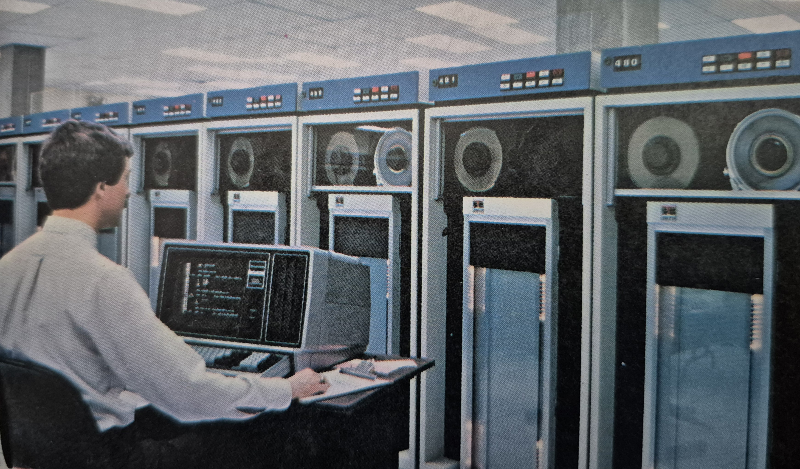
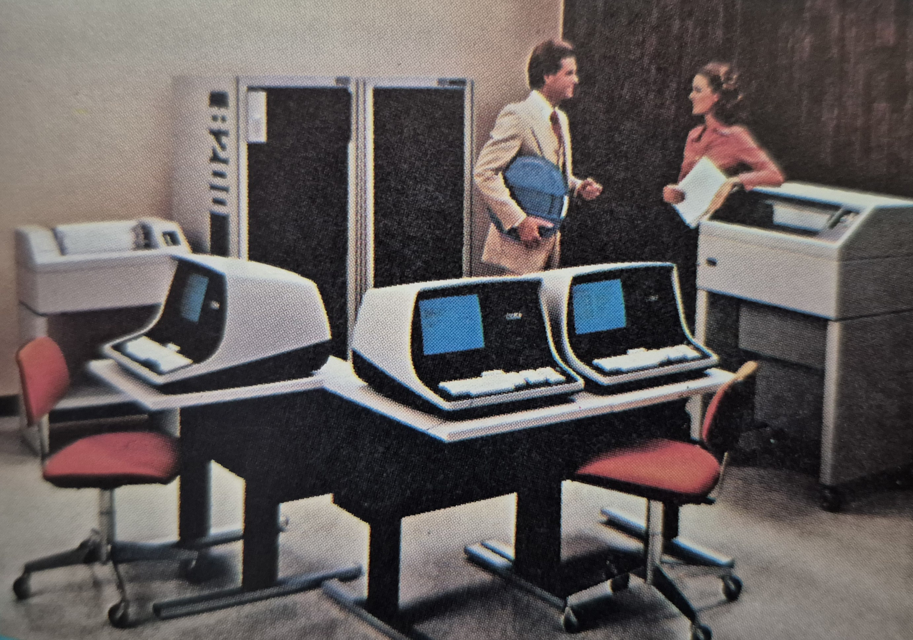

# Kitbash

Self-Refactoring Crosslinking

<<<<<<< HEAD
<<<<<<< HEAD

<!--
=======
>>>>>>> ab2fa95 (Macroscale Solutions)
=======

<!--
>>>>>>> 1d6db72 (Recursive Quantifiers)

<<<<<<< HEAD
<<<<<<< HEAD
-->
=======
>>>>>>> ab2fa95 (Macroscale Solutions)
=======
-->
>>>>>>> 1d6db72 (Recursive Quantifiers)
