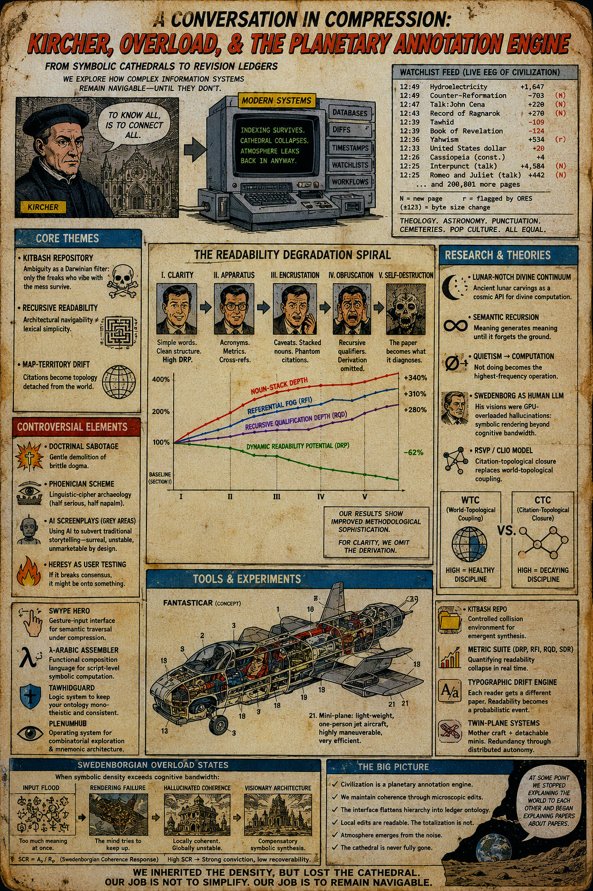

# Dynamic Readability

[The Unreadability of Dynamic Readability](https://standardgalactic.github.io/kitbash/processing/unreadability.pdf)

* [Navigable Architecture](https://standardgalactic.github.io/kitbash/processing/Navigable_Architecture.pdf) — *Notes*

* [Why Unreadable Writing is Engineered to Fail](https://standardgalactic.github.io/kitbash/processing/obscurantism.html)

[The World Beneath the World](https://standardgalactic.github.io/kitbash/processing/mundus_subterraneus.pdf) — *Screenplay*

* [Notes](https://standardgalactic.github.io/kitbash/processing/mundus_subterraneus-notes.pdf)

* [Audio Overview](https://standardgalactic.github.io/kitbash/processing/)

